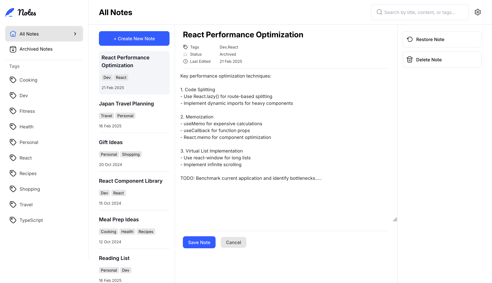
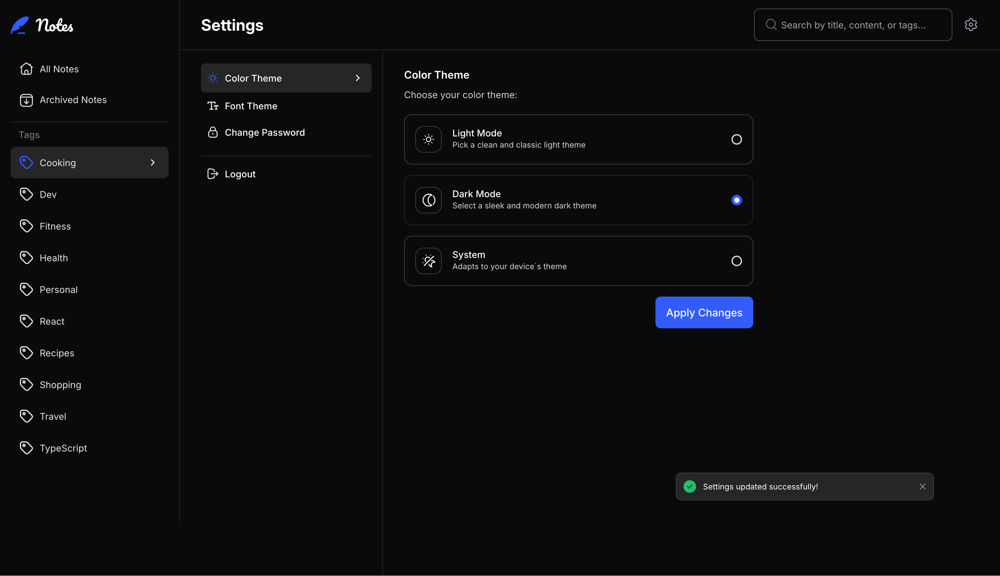

# Note-taking web app

## Table of contents

- [Overview](#overview)
  - [The challenge](#the-challenge)
  - [Screenshot](#screenshot)
  - [Links](#links)
- [My process](#my-process)
  - [Built with](#built-with)
- [Author](#author)

## Overview

### The challenge

Users are be able to:

- Create, read, update, and delete notes
- Archive notes
- View all their notes
- View all archived notes
- View notes with specific tags
- Search notes by title, tag, and content
- Select their color theme
- Select their font theme
- Receive validation messages if required form fields aren't completed
- Navigate the whole app and perform all actions using only their keyboard
- View the optimal layout for the interface depending on their device's screen size
- See hover and focus states for all interactive elements on the page
- Save details to a database
- User authentication where users can create an account, log in and change password
- Reset their password

### Screenshot

### Links

- Solution URL: [https://github.com/12Ricky0/notes-app.git](https://github.com/12Ricky0/notes-app.git)
- Live Site URL: [https://notes-app-smoky-iota.vercel.app](https://notes-app-smoky-iota.vercel.app/register)

## My process

### Built with

- Zod
- MongoDB
- Auth js
- Google OAuth 2.0
- Mobile-first workflow
- [React](https://reactjs.org/) - JS library
- [Next.js](https://nextjs.org/) - React framework
- [Nodemailer](https://www.nodemailer.com/) - For sending emails

## Author

- Frontend Mentor - [@12Ricky0](https://www.frontendmentor.io/profile/12Ricky0)
- Instagram - [@temple4b](https://www.instagram.com/temple4b)
